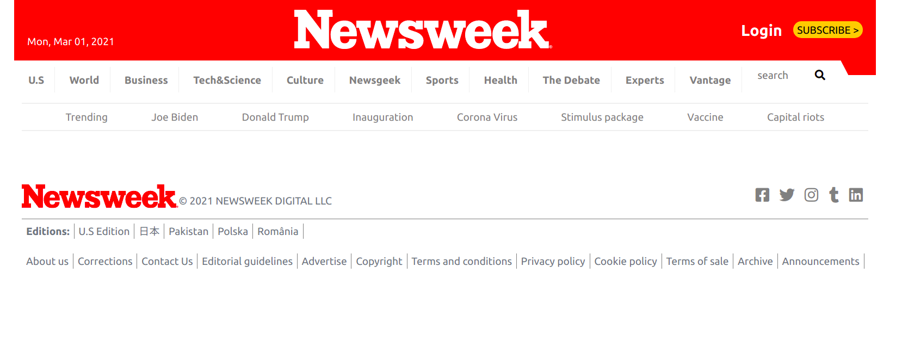

# Newsweek Website

>This a clone of the Newsweek website which provides trending stories in America. The various topics are arranged into articles, sections and links leading to more resources.

Additional description about the project and its features.

## Built With

- HTML
- CSS
- Bootstrap

## Live Demo

[Live Demo Link](https://samroodali.github.io/newsweek-clone/)

## Requirements

1. Nodejs for the linters and the sass compiler

## Getting Started
To get a local copy up and running follow these simple example steps.

1. Go to https://github.com/SamroodAli/newsweek-clone
2. Click on the code and copy the HTML code.
3. Use terminal to clone this repository on your local machine.
4. Run `git checkout -b your-branch-name`. Make your contributions
5. Push your branch up to your forked repository
6. Open a Pull Request with a detailed description of the development branch of the original project for a review
## Authors

👤 **Author1**

- GitHub: [@SamroodAli](https://github.com/SamroodAli)
- LinkedIn: [Samrood Ali](https://www.linkedin.com/in/samrood-ali/)

👤 **Author2**

- Github: [@Leon-Mbegera](https://github.com/Leon-Mbegera)
- Linkedin: [leon mbegera](https://www.linkedin.com/in/leon-mbegera-053991174/)
## 🤝 Contributing

Contributions, issues, and feature requests are welcome!

Feel free to check the [issues page](issues/).

## Show your support

Give a ⭐️ if you like this project!

## Acknowledgments

- Hat tip to anyone whose code was used
- Inspiration
- etc

## 📝 License

This project is [MIT](lic.url) licensed.
